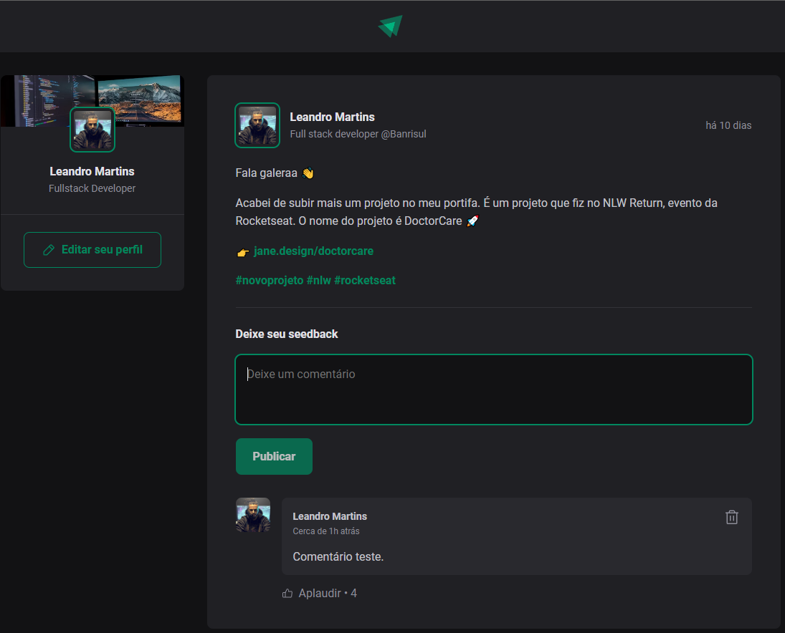

<h1 align="center">
  Ignite Feed
</h1>

  <a href="#-layout">Layout</a>&nbsp;&nbsp;&nbsp;|&nbsp;&nbsp;&nbsp;
  <a href="#-projeto">Projeto</a>&nbsp;&nbsp;&nbsp;|&nbsp;&nbsp;&nbsp;
  <a href="#-tecnologias">Tecnologias</a>&nbsp;&nbsp;&nbsp;|&nbsp;&nbsp;&nbsp;    
  <a href="#memo-licença">Licença</a>

 

  

## 💻 Projeto

O Ignite Feed é uma aplicação que simula um feed de rede socias. 

A aplicação foi desenvolvida no módulo de Fundamentos, da trilha de Reacjs, do curso Ignite da Rocketseat. 

## 🚀 Tecnologias

Esse projeto foi desenvolvido com as seguintes tecnologias:

- Reactjs
- Vite
- Typescript

## :memo: Licença

Esse projeto está sob a licença MIT. Veja o arquivo [LICENSE](LICENSE.md) para mais detalhes.

---
